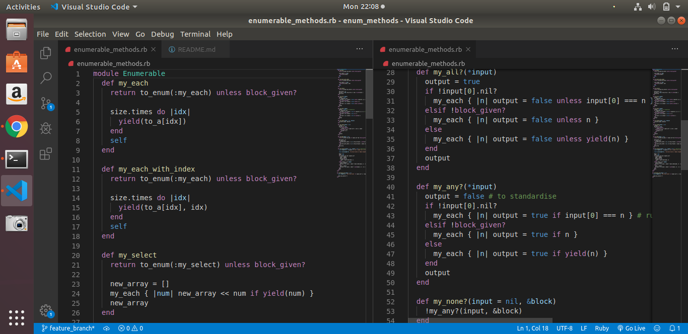
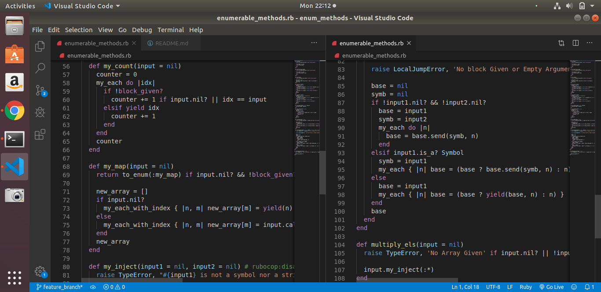

# enum_methods
# 🧐 PROJECT TITLE: ENUMERABLE METHODS

> Building custom-enumerable methods.

These are the list of enumerable methods to recreate;

### 📝 Enumerable Methods List:

- my_each
- my_each_with_index
- my_select
- my_all?
- my_any?
- my_none?
- my_count
- my_map
- my_inject
- multiply_els

## 🛠 Built With

- Ruby
- Rubocop

## Project Screenshot

## Prequisities

- Ruby must be installed on local machine
- Basic CLI knowledge

## 🔧 Set-up

- Clone/download the repo to your local machine
- On your CLI run enumerable_methods.rb
- Similarly, code can be copied and pasted to https://repl.it platform with Ruby as the language

## 👤 Authors

👤 Luciano Sarno

- Github: [@lucianosarno](https://github.com/lucianosarno)
- Linkedin: [@ls-soares](https://www.linkedin.com/in/ls-soares/)
- Twitter: [@Luciano68238988](https://twitter.com/Luciano68238988)

👤 Adesoji Adewumi

- Github: [@AdesojiCodeMaster](https://github.com/AdesojiCodeMaster)
- Linkedin: [@adesoji-adewumi](https://www.linkedin.com/in/adesoji-adewumi)
- Twitter: [@codemas22665735](https://twitter.com/codemas22665735)

👤 **Giordano Díaz**

- Github: [@diazgio](https://github.com/diazgio)
- Twitter: [@giordano_diaz](https://twitter.com/giordano_diaz)
- LinkenIn:[LinkenIn](www.linkedin.com/in/Giordano-Diaz)

## 🤝 Contributing

Contributions, issues and feature requests are welcome!
Feel free to check the [issues page](issues/)

## Show your support

Give a ⭐️ if you like this project!

## Acknowledgments

- The Odin Project
- Microverse Program

## 📝 License

This project is open-licensed.

## 📝 Credits
Microverse.
